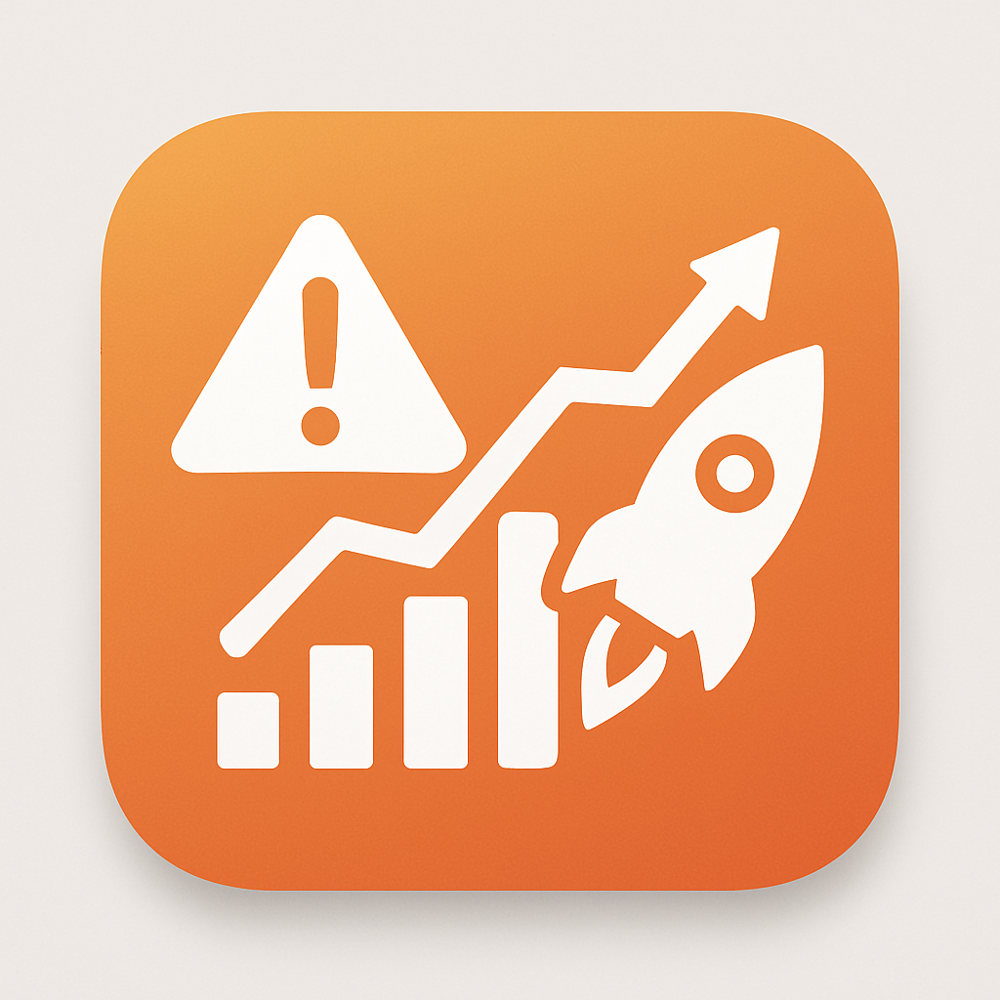

  

<h1 align="center">RISQ Platform – AI-Powered Startup Risk Assessment System</h1>

A full-stack AI-driven platform offering a mobile app, backend services, and a web dashboard for startup founders, investors, and advisors to assess, manage, and mitigate business risk with real-time insights.

---

## 🌟 Project Overview

**RISQ** is an intelligent, multi-platform solution designed for startup risk management. It combines a **Flutter mobile app** and a **Go-powered backend** with integrated AI and real-time data processing. The platform helps users make data-driven decisions by analyzing technical, financial, operational, and market-related risks.

---

## 🎯 Mission & Vision

- **Mission**: To provide transparent and intelligent risk assessment tools for startups and investors.
- **Vision**: To become the go-to decision support platform in the global startup ecosystem.
- **Target Audience**: Founders, incubators, VCs, accelerators, analysts.
- **Market Position**: At the intersection of AI, fintech, and startup advisory services.

---

## 📱 Mobile App (Flutter)

- **Framework**: Flutter 3.x using Dart
- **UX/UI**: Material Design 3, intuitive flows, rich visuals
- **Key Screens**:
  - Risk Score Gauges
  - AI Speculation Tools
  - Guided Onboarding (4 steps)
  - Notifications & Suggestions
  - Profile Management

---

## ⚙️ Backend Architecture

- **Language**: Go 1.24+
- **Framework**: Fiber (HTTP)
- **Database**: PostgreSQL with SQL migrations
- **Caching**: Redis
- **Messaging**: NATS for event streaming
- **AI Services**: OpenAI GPT-4 + custom ML pipelines
- **Deployment**: Docker, Docker Compose, Kubernetes-ready

---

## 🤖 Intelligence & Risk Engine

### Risk Assessment Engine

- Multi-dimensional risk scores (Market, Tech, Ops, Finance, Regulatory)
- Confidence scoring and historical trends
- Gauge-style visualizations

### AI-Powered Decision Tools

- GPT-4 + vector embeddings for context-aware suggestions
- Retrieval-Augmented Generation (RAG) for better memory
- Action recommendations with quantified certainty

### Real-time Data Integration

- **NewsAPI** for sentiment and trend analysis
- **MarketStack** for financial market data
- **Industry Insights** tailored to startup domains

---

## 📦 Tech Stack Summary

| Layer        | Tech Stack |
|--------------|------------|
| **Frontend** | Flutter (Mobile) |
| **Backend**  | Go + Fiber |
| **Database** | PostgreSQL |
| **Caching**  | Redis |
| **Messaging**| NATS |
| **AI**       | GPT-4, Embeddings, RAG |
| **DevOps**   | Docker, CI/CD |

---

## 💼 Business Analysis

- **TAM/SAM/SOM**: Large global startup base and VC ecosystem
- **Revenue Model**: Freemium + Pro + Advisory SaaS tiers
- **Competitive Edge**: AI-native, real-time, multi-layered insights
- **Key Metrics**:
  - User Growth
  - Subscription Retention
  - AI Recommendation Accuracy

---

## 🧠 Strategic Planning

- **Risk Mitigation**: Full encryption, rate limiting, audit logs
- **Team Requirements**: Mobile devs, backend engineers, AI/ML experts
- **Advisory Board**: Industry veterans in startup acceleration and AI
- **Long-term Goals**: Expansion to global ecosystems, B2B licensing

---

## 🏗️ Project Structure

### `/mobile`
- `lib/` – Screens, services, widgets, themes

### `/backend`
- `cmd/`, `internal/`, `routes/`, `db/`, `events/`

### `/ai`
- `rag/`, `openai/`, `embeddings/`, `decision-engine/`

---

## 📊 Market & Model

- **Target Market**: Startups, incubators, accelerators
- **Pricing Strategy**: Tiered SaaS subscriptions
- **Growth Strategy**: Community-led growth + B2B sales
- **Analytics Focus**: Risk score distribution, feature usage, decision accuracy

---

## 🙌 Final Note

**RISQ** brings together advanced technology and design thinking to solve one of the most crucial problems for early-stage ventures: understanding and mitigating risk. By combining a **mobile app**, a **powerful backend**, and **AI capabilities**, RISQ is not just a tool—it's a strategic asset.
